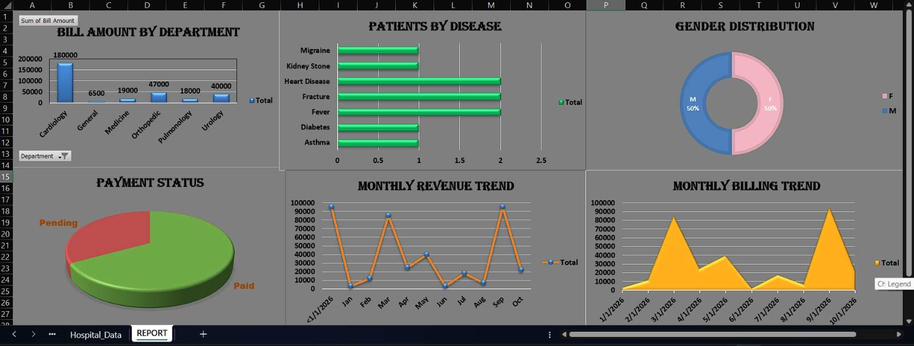

# 🏥 Hospital Excel Dashboard

### By Riya Basera

## 📌 Project Overview

This Hospital Excel Dashboard is developed using Microsoft Excel to analyze hospital data through interactive Pivot Tables and Pivot Charts. It provides insights into patient records, billing, payment status, gender distribution, disease analysis, and monthly trends.

## 📊 Dashboard Features
- Department-wise Bill Amount Analysis
- Disease-wise Patient Count
- Gender Distribution
- Payment Status (Paid vs Pending)
- Monthly Billing Trend
- Interactive Pivot Charts

## 🛠️ Tools Used
- Microsoft Excel
- Pivot Tables
- Pivot Charts
- Data Cleaning
- Data Analysis
- Data Visualization
- Dashboard Design

## 📈 Charts Included
- Column Chart
- Bar Chart
- Doughnut Chart
- Pie Chart
- Line Chart
- Area Chart

## 📂 Project Files
- Hospital_Dashboard.xlsx
- IMG-20260730-WA0011.jpg
- README.md

## 👩‍💻 Author
**Riya Basera**  
**B.Tech (Data Science) | Aspiring Data Analyst**

---
⭐ If you like this project, don't forget to **Star** this repository.
